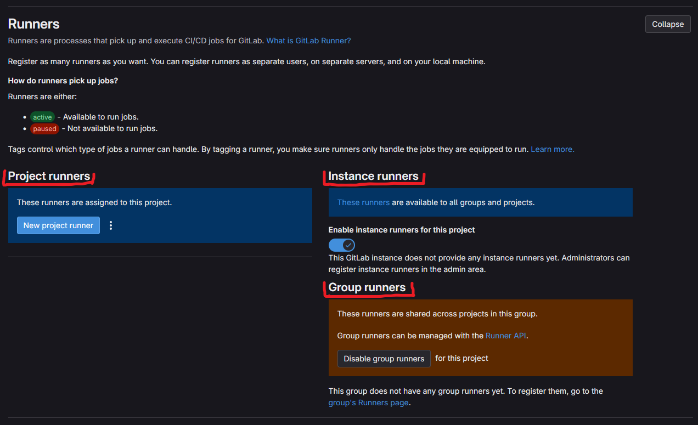

Администрирование GitLab Runner охватывает полный жизненный цикл управления инфраструктурой выполнения заданий CI/CD:

- Развертывание и регистрация раннеров (runners)
- Настройка исполнителей для конкретных рабочих нагрузок
- Масштабирование потенциала в соответствии с ростом организации

---

> [Туториал. Создание, регистрация и запуск раннера (runner)](https://docs.gitlab.com/tutorials/create_register_first_runner/)

> [Туториал. Автоматическое создание и регистрация раннера (runner)](https://docs.gitlab.com/tutorials/automate_runner_creation/)

---

## Шаг 1: Установка раннера (runners)

Установите GitLab Runner, чтобы создать приложение, выполняющее задания CI/CD.

Установка включает загрузку и настройку GitLab Runner в вашей целевой инфраструктуре. Процесс установки зависит от целевой операционной системы. GitLab предоставляет двоичные файлы и инструкции по установке для Linux, Windows, macOS и z/OS. Выберите способ установки в зависимости от вашей платформы и требований.

Дополнительную информацию см. в разделе [Установка GitLab Runner](./install_gitlab_runner.mdx).

## Шаг 2: Регистрация раннера (runners)

Зарегистрируйте свои раннеры (runners), чтобы установить аутентифицированную связь между вашим экземпляром GitLab и компьютером, на котором установлен GitLab Runner. Регистрация подключает отдельных участников к вашему экземпляру GitLab с помощью токенов аутентификации. Во время регистрации вы указываете область действия раннера (runner), тип исполнителя и другие параметры конфигурации, которые определяют, как работает раннер (runner).

Прежде чем зарегистрировать раннер, вам следует определить, хотите ли вы ограничить его конкретной группой или проектом GitLab. Во время регистрации вы можете настроить самоуправляемые исполнители с различными областями доступа, чтобы определить, для каких проектов они доступны:

- [**Instance runners**](https://docs.gitlab.com/ci/runners/runners_scope/#instance-runners): Доступно для всех проектов в вашем экземпляре GitLab.
- [**Group runners**](https://docs.gitlab.com/ci/runners/runners_scope/#group-runners): Доступно для всех проектов в определенной группе и ее подгруппах.
- [**Project runners**](https://docs.gitlab.com/ci/runners/runners_scope/#project-runners): Доступно только для конкретного проекта.

При регистрации раннера добавьте к нему теги, чтобы направлять задания соответствующим исполнителям. Назначайте значимые теги и ссылайтесь на них в файлах `.gitlab-ci.yml`, чтобы задания выполнялись в раннерах с необходимыми возможностями.

Когда выполняется задание CI/CD, оно знает, какой исполнитель (раннер) использовать, просматривая назначенные теги. Теги — единственный способ отфильтровать список доступных кандидатов на задание.

Для получения дополнительной информации см.:

- [Register a runner](https://docs.gitlab.com/runner/register/)
- [Migrate to the new runner registration workflow](https://docs.gitlab.com/ci/runners/new_creation_workflow/)
- [Instance runners](https://docs.gitlab.com/ci/runners/runners_scope/#instance-runners)
- [Group runners](https://docs.gitlab.com/ci/runners/runners_scope/#group-runners)
- [Project runners](https://docs.gitlab.com/ci/runners/runners_scope/#project-runners)
- [Tags](https://docs.gitlab.com/ci/yaml/#tags)

## Шаг 3: Выбор исполнителя (executors)

Исполнители GitLab Runner — это различные среды и методы, которые GitLab Runner может использовать для выполнения заданий CI/CD. Они определяют, как и где на самом деле выполняются ваши задания конвейера. Правильная конфигурация гарантирует выполнение заданий в соответствующих средах с правильными границами безопасности.

При регистрации раннера вам необходимо выбрать исполнителя. GitLab Runner использует систему исполнителя, чтобы определить, где и как выполнять задания. Исполнитель определяет среду, в которой выполняется каждое задание. Выбирайте исполнителей, которые соответствуют требованиям вашей инфраструктуры и задания.

Например:

- Если вы хотите, чтобы ваше задание CI/CD запускало команды PowerShell, вы можете установить GitLab Runner на сервер Windows, а затем зарегистрировать раннер, который использует `shell` исполнителя.
- Если вы хотите, чтобы ваше задание CI/CD запускало команды в специальном контейнере Docker, вы можете установить GitLab Runner на сервер Linux и зарегистрировать раннер, который использует исполнителя `Docker`.

Эти примеры представляют собой лишь пару возможных конфигураций. Вы можете установить GitLab Runner на виртуальную машину и использовать другую виртуальную машину в качестве исполнителя.

Для получения дополнительной информации см. [Исполнители (executors)](https://docs.gitlab.com/runner/executors/).

## Шаг 4: Настройки раннера (runners) и запуск jobs

Вы можете настроить GitLab Runners, отредактировав файл `config.toml`, который автоматически создается при установке и регистрации раннера. В этом файле вы можете редактировать настройки как для конкретного раннера, так и для всех раннеров. Настройте его, чтобы установить ограничения параллелизма (concurrency limits), уровни ведения журнала (logging levels), настройки кэша (cache settings), ограничения ЦП (CPU limits) и параметры, специфичные для исполнителя (executor-specific). Используйте единые конфигурации для всего вашего парка раннеров.

После того как раннер настроен и доступен для вашего проекта, ваши задания CI/CD смогут использовать его.

Раннеры обычно обрабатывают задания на том же компьютере, на котором вы установили GitLab Runner. Однако вы также можете запускать задания обработки в контейнере, в кластере Kubernetes или в автоматически масштабируемых экземплярах в облаке.

Для получения дополнительной информации см.:

- [Configure GitLab Runners](https://docs.gitlab.com/runner/configuration/advanced-configuration/)
- [CI/CD jobs](https://docs.gitlab.com/ci/jobs/)
